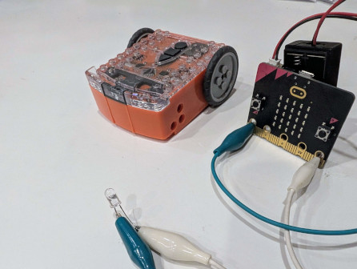
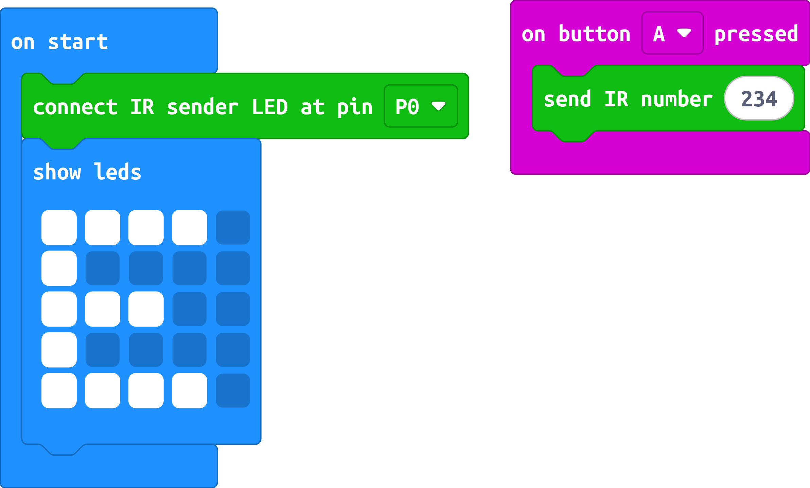
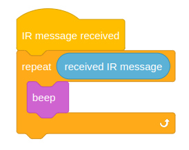

# MakerBit IR Sender

MakeCode extension for sending commands to an Edison Robot via an IR-emitting LED.



## Edison Robot

[Edison](https://meetedison.com/) is a programmable robot designed to be a complete STEM teaching resource for coding and robotics education for students from 4 to 16 years of age.

Through the built-in IR sensors it is capable of receiving IR messages.

This MakeCode extension implements the [Edison IR protocol](doc/Edison_Infrared_Communication_Protocol.pdf) and allows sending IR messages from 1 to 255.

There is currently no code to handle receiving IR messages, but pull requests are definitely welcome.

## IR Sender Blocks

These blocks allow you to send commands compatible with the [Edison Robot](https://meetedison.com/) using an IR message:

```sig
input.onButtonPressed(Button.A, function () {
    edison.sendIrNumber(234)
})
edison.connectIrSenderLed(AnalogPin.P0)
```


In this photo, the IR emitter LED is connected directly to the micro:bit with alligator clips. The short leg of the LED is connected with the white alligator clip to GND (ground), and the long leg of the LED to P0.

You can send a number from 1 to 255.


### Edison connectIrSenderLed

First associate the IR-emitting LED with the specified pin.

```sig
edison.connectIrSenderLed(AnalogPin.P0)
```

### Edison sendIrNumber

Sends an integer IR message using the Edison protocol. (1 to 255)

```sig
edison.sendIrNumber(5);
```

The send IR number block sends a coded number. Allowed range from 1 to 255 due to protocol limitations. Higher numbers will be reduced to the binary equivalent. (266 becomes 0, 257 becomes 1, ...)

### Using Blocks
With the blocks, for example:


## Edison
On the side of Edison you can use [EdPy](https://www.edpyapp.com/) or [EdScratch](https://www.edscratchapp.com/) to handle the IR message.

### EdScratch
For example



### EdPy

An example code in EdPy, that beeps the received message in different tones.
```python
#-------------Setup----------------
import Ed

Ed.EdisonVersion = Ed.V2
Ed.DistanceUnits = Ed.CM
Ed.Tempo = Ed.TEMPO_MEDIUM

#--------Your code below-----------
# beep the number of times based on the IR message
def ir_receive():
    message = Ed.ReadIRData()

    hundreds = message // 100
    tens = (message % 100) // 10
    units = message % 10

    for i in range(hundreds):
        Ed.PlayTone(Ed.NOTE_A_6, Ed.NOTE_SIXTEENTH)
        Ed.TimeWait(200, Ed.TIME_MILLISECONDS)

    Ed.TimeWait(400, Ed.TIME_MILLISECONDS)

    for i in range(tens):
        Ed.PlayTone(Ed.NOTE_B_6, Ed.NOTE_SIXTEENTH)
        Ed.TimeWait(200, Ed.TIME_MILLISECONDS)

    Ed.TimeWait(400, Ed.TIME_MILLISECONDS)

    for i in range(units):
        Ed.PlayTone(Ed.NOTE_C_7, Ed.NOTE_SIXTEENTH)
        Ed.TimeWait(200, Ed.TIME_MILLISECONDS)

    # Small delay before checking for a new IR signal
    Ed.TimeWait(1, Ed.TIME_SECONDS)

#forever
while True:
    ir_receive()
    pass
```

## License

This software is licensed under MIT License. See the LICENSE file for more details.

Copyright 2025 Christophe Vandeplas.

Heavily inspired from [pxt-makerbit-ir-transmitter](https://github.com/1010technologies/pxt-makerbit-ir-transmitter) which is MIT licensed.

## Supported targets

- for PXT/microbit
- for PXT/calliope
